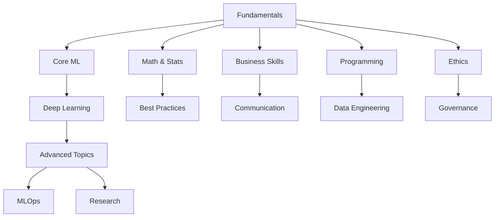
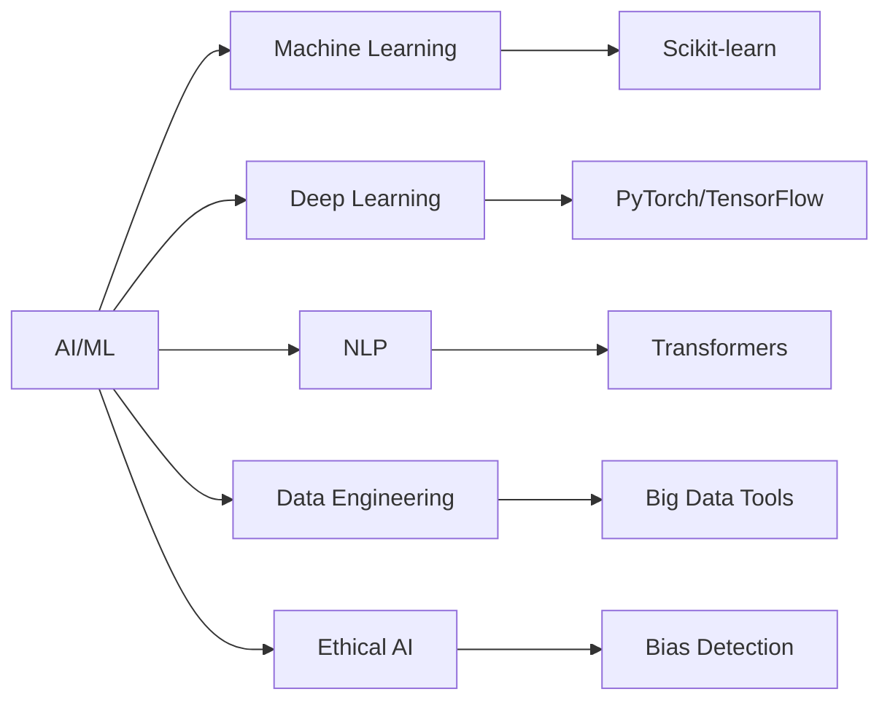
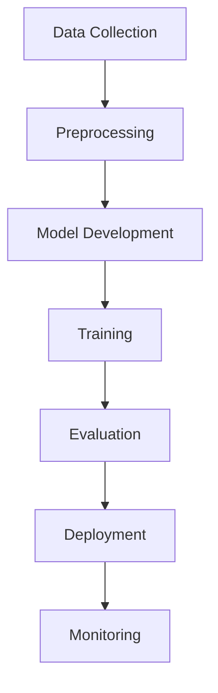
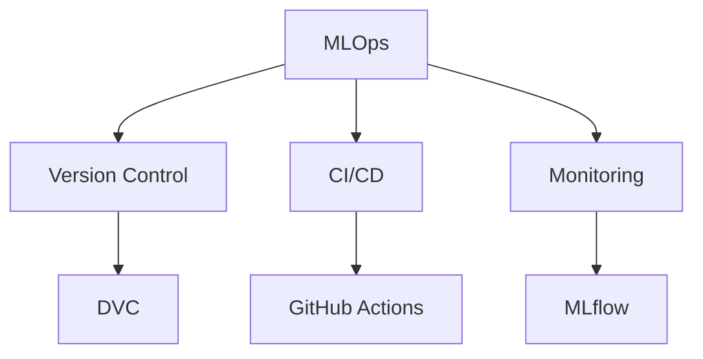

# AI/ML Learning Resources

A comprehensive collection of resources for learning Artificial Intelligence (AI), Machine Learning (ML), and Natural Language Processing (NLP). This repository provides structured learning paths, practical examples, and curated resources for AI/ML practitioners at all levels.

## ⭐ Give a Star!
If you find this repository helpful or are using it to learn AI/ML development, please give it a star. Thanks!

## 📋 Table of Contents
- [Core AI/ML](#-core-aiml)
  - [Machine Learning](#machine-learning)
  - [Deep Learning](#deep-learning)
- [Natural Language Processing](#-natural-language-processing)
- [Libraries & Frameworks](#️-libraries--frameworks)
- [Data Science Tools](#-data-science-tools)
- [Business & Communication](#-business--communication)
- [Data Engineering](#-data-engineering)
- [Ethical AI](#-ethical-ai)
- [Mathematics](#-mathematics)
- [Programming Fundamentals](#-programming-fundamentals)
- [MLOps & Deployment](#-mlops--deployment)
- [Learning Resources](#-learning-resources)
- [Best Practices](#-best-practices)
- [Learning Path](#-learning-path)
- [Contributing](#-contributing)
- [License](#-license)

## ⚠️ Disclaimer
> This repository aims to provide a structured learning path for AI/ML technology and its ecosystem. The content is designed to guide you in understanding core concepts and practical implementation, rather than promoting specific frameworks or technologies. Remember that AI/ML field evolves rapidly - always verify information and stay updated with the latest developments.

## 📊 Learning Paths

### Learning Progression

### Technology Stack

### Model Development

### MLOps Pipeline

## 📚 Core AI/ML

### Machine Learning
- [Supervised Learning](./machine-learning/supervised/README.md)
  - Classification & Regression
  - Model Evaluation
  - Feature Engineering
  - Best Practices
  - [Learning Resources](https://www.coursera.org/specializations/machine-learning-introduction)

- [Unsupervised Learning](./machine-learning/unsupervised/README.md)
  - Clustering Algorithms
  - Dimensionality Reduction
  - Anomaly Detection
  - Implementation Guide
  - [Learning Resources](https://www.coursera.org/learn/unsupervised-learning-in-python)

### Deep Learning
- [Neural Networks](./deep-learning/neural-networks/README.md)
  - Network Architectures
  - Training Techniques
  - Implementation Guide
  - Best Practices
  - [Learning Resources](https://www.deeplearning.ai/)

- [Computer Vision](./deep-learning/computer-vision/README.md)
  - CNN Architectures
  - Object Detection
  - Image Processing
  - Practical Applications
  - [Learning Resources](http://cs231n.stanford.edu/)

## 🔤 Natural Language Processing

### Core NLP
- [Text Processing](./nlp/text-processing/README.md)
  - Text Preprocessing
  - Tokenization
  - POS Tagging & NER
  - Implementation Guide
  - [Learning Resources](https://web.stanford.edu/~jurafsky/slp3/)

- [Projects & Applications](./projects/nlp/README.md)
  - Text Classification
  - Named Entity Recognition
  - Sentiment Analysis
  - Practical Examples
  - [Learning Resources](https://huggingface.co/learn/nlp-course)

## 🛠️ Libraries & Frameworks

### Deep Learning Frameworks
- [TensorFlow](./frameworks/tensorflow/README.md)
  - Core Components
  - Model Development
  - Deployment Guide
  - Best Practices
  - [Learning Resources](https://www.tensorflow.org/learn)

- [PyTorch](./frameworks/pytorch/README.md)
  - Core Features
  - Model Building
  - Training & Deployment
  - Best Practices
  - [Learning Resources](https://pytorch.org/tutorials/)

### NLP Libraries
- [Hugging Face](./frameworks/hugging-face/README.md)
  - Transformers Library
  - Model Training
  - Deployment Guide
  - Best Practices
  - [Learning Resources](https://huggingface.co/learn)

## 📊 Data Science Tools

### Data Processing
- [NumPy & Pandas Guide](./data-science/numpy-pandas/README.md)
  - Data Manipulation
  - Analysis Tools
  - Best Practices
  - Performance Tips
  - [Learning Resources](https://pandas.pydata.org/docs/getting_started/index.html)

### Visualization
- [Data Visualization Guide](./data-science/visualization/README.md)
  - Matplotlib
  - Seaborn
  - Plotly
  - Best Practices
  - [Learning Resources](https://python-graph-gallery.com/)

## 💼 Business & Communication

### Business Skills
- [Case Studies](./business/case-studies/README.md)
  - Industry Applications
  - Success Stories
  - Lessons Learned
  - Implementation Strategies
  - [Learning Resources](https://hbr.org/topic/technology-and-analytics)

- [Communication](./business/communication/README.md)
  - Technical Writing
  - Presentation Skills
  - Stakeholder Management
  - Documentation
  - [Learning Resources](https://www.coursera.org/learn/technical-writing)

- [Problem Solving](./business/problem-solving/README.md)
  - Business Analysis
  - Solution Design
  - Implementation Planning
  - Best Practices
  - [Learning Resources](https://www.mindtools.com/pages/article/problem-solving.htm)

## 🔄 Data Engineering

### Core Components
- [API Integration](./data-engineering/api-integration/README.md)
  - REST APIs
  - GraphQL
  - Webhooks
  - Authentication
  - [Learning Resources](https://www.redhat.com/en/topics/api/what-is-api-integration)

- [Big Data Tools](./data-engineering/big-data-tools/README.md)
  - Hadoop
  - Spark
  - Data Lakes
  - ETL Pipelines
  - [Learning Resources](https://www.coursera.org/learn/big-data-integration-processing)

- [Preprocessing](./data-engineering/preprocessing/README.md)
  - Data Cleaning
  - Feature Engineering
  - Data Validation
  - Pipeline Development
  - [Learning Resources](https://scikit-learn.org/stable/modules/preprocessing.html)

## 🤝 Ethical AI

### Core Principles
- [Bias Detection](./ethical-ai/bias-detection/README.md)
  - Data Bias
  - Model Bias
  - Testing Methods
  - Mitigation Strategies
  - [Learning Resources](https://ai.google/responsibilities/responsible-ai-practices/)

- [Explainability](./ethical-ai/explainability/README.md)
  - Model Interpretation
  - Feature Importance
  - SHAP Values
  - LIME
  - [Learning Resources](https://christophm.github.io/interpretable-ml-book/)

- [Governance](./ethical-ai/governance/README.md)
  - Ethical Guidelines
  - Compliance
  - Risk Management
  - Best Practices
  - [Learning Resources](https://www.microsoft.com/en-us/ai/responsible-ai)

## 📐 Mathematics

### Core Mathematics
- [Calculus](./mathematics/calculus/README.md)
  - Derivatives
  - Integrals
  - Optimization
  - Applications in ML
  - [Learning Resources](https://www.khanacademy.org/math/calculus-1)

- [Linear Algebra](./mathematics/linear-algebra/README.md)
  - Matrices
  - Vectors
  - Eigenvalues
  - Applications in ML
  - [Learning Resources](https://ocw.mit.edu/courses/18-06-linear-algebra-spring-2010/)

- [Optimization](./mathematics/optimization/README.md)
  - Gradient Descent
  - Convex Optimization
  - Constrained Optimization
  - Applications
  - [Learning Resources](https://www.coursera.org/learn/optimization-techniques-python)

- [Probability & Statistics](./mathematics/probability-statistics/README.md)
  - Probability Theory
  - Statistical Inference
  - Hypothesis Testing
  - Applications in ML
  - [Learning Resources](https://www.statlearning.com/)

## 💻 Programming

### Core Programming
- [Performance Optimization](./programming/performance-optimization/README.md)
  - Code Profiling
  - Memory Management
  - Parallel Processing
  - Best Practices
  - [Learning Resources](https://realpython.com/python-performance-analysis/)

- [Python Advanced](./programming/python-advanced/README.md)
  - Advanced Features
  - Design Patterns
  - Testing
  - Best Practices
  - [Learning Resources](https://docs.python-guide.org/)

- [R Programming](./programming/r-programming/README.md)
  - Data Analysis
  - Statistical Computing
  - Visualization
  - Best Practices
  - [Learning Resources](https://www.r-project.org/about.html)

- [SQL Fundamentals](./programming/sql-fundamentals/README.md)
  - Query Optimization
  - Database Design
  - Data Modeling
  - Best Practices
  - [Learning Resources](https://mode.com/sql-tutorial/)

## 🔧 MLOps & Deployment

### MLOps
- [MLOps Guide](./mlops/README.md)
  - Model Deployment
  - Monitoring
  - CI/CD Pipelines
  - Best Practices
  - [Learning Resources](https://ml-ops.org/)

### CI/CD
- [CI/CD Pipelines](./mlops/cicd/README.md)
  - Pipeline Design
  - Automation
  - Testing Strategies
  - Best Practices
  - [Learning Resources](https://www.coursera.org/learn/mlops-fundamentals)

### Cloud Platforms
- [Cloud Integration](./mlops/cloud-platforms/README.md)
  - AWS
  - Azure
  - GCP
  - Best Practices
  - [Learning Resources](https://cloud.google.com/training/machinelearning-ai)

### Deployment
- [Deployment Strategies](./mlops/deployment/README.md)
  - Containerization
  - Orchestration
  - Scaling
  - Best Practices
  - [Learning Resources](https://kubernetes.io/docs/concepts/workloads/controllers/deployment/)

### Monitoring
- [System Monitoring](./mlops/monitoring/README.md)
  - Performance Metrics
  - Alerting
  - Logging
  - Best Practices
  - [Learning Resources](https://www.datadoghq.com/blog/monitoring-machine-learning-models/)

## 📚 Learning Resources

### YouTube Channels
- [3Blue1Brown](https://www.youtube.com/c/3blue1brown) - Math foundations
- [StatQuest](https://www.youtube.com/c/joshstarmer) - Statistical concepts
- [Yannic Kilcher](https://www.youtube.com/c/yannickilcher) - Paper reviews
- [Two Minute Papers](https://www.youtube.com/c/karoly) - AI news and developments
- [Weights & Biases](https://www.youtube.com/c/wandbai) - MLOps and experiments
- [Sentdex](https://www.youtube.com/c/sentdex) - Practical ML tutorials
- [Deep Learning AI](https://www.youtube.com/c/Deeplearningai) - Deep learning concepts

### Blogs & Newsletters
- [Towards Data Science](https://towardsdatascience.com/)
- [Machine Learning Mastery](https://machinelearningmastery.com/)
- [Sebastian Ruder's Blog](https://ruder.io/)
- [Distill.pub](https://distill.pub/)
- [Google AI Blog](https://ai.googleblog.com/)
- [OpenAI Blog](https://openai.com/blog/)
- [Papers with Code](https://paperswithcode.com/)

### Podcasts
- [TWIML AI Podcast](https://twimlai.com/podcast/)
- [Data Skeptic](https://dataskeptic.com/)
- [Machine Learning Guide](https://ocdevel.com/mlg)
- [Practical AI](https://changelog.com/practicalai)
- [The AI Podcast](https://blogs.nvidia.com/ai-podcast/)
- [Gradient Dissent](https://wandb.ai/fully-connected/gradient-dissent)

### Books & Papers
- ["Deep Learning" by Goodfellow et al.](https://www.deeplearningbook.org/)
- ["Pattern Recognition and Machine Learning"](https://www.microsoft.com/en-us/research/uploads/prod/2006/01/Bishop-Pattern-Recognition-and-Machine-Learning-2006.pdf)
- ["Speech and Language Processing"](https://web.stanford.edu/~jurafsky/slp3/)
- [Papers with Code](https://paperswithcode.com/)
- [arXiv ML Papers](https://arxiv.org/list/cs.LG/recent)

### Development Tools
- [TensorFlow](https://www.tensorflow.org/)
- [PyTorch](https://pytorch.org/)
- [scikit-learn](https://scikit-learn.org/)
- [Hugging Face](https://huggingface.co/)
- [MLflow](https://mlflow.org/)
- [Weights & Biases](https://wandb.ai/)
- [DVC](https://dvc.org/)
- [Label Studio](https://labelstud.io/)

## 🚀 Project Ideas

### Beginner Projects
- Image Classification
- Sentiment Analysis
- Time Series Forecasting
- Customer Churn Prediction
- Movie Recommendation System
- Text Generation
- Data Visualization Dashboard

### Intermediate Projects
- Object Detection System
- Language Translation Model
- Fraud Detection System
- Stock Price Prediction
- Chatbot Development
- Image Style Transfer
- Anomaly Detection System

### Advanced Projects
- GANs for Image Generation
- Reinforcement Learning Agent
- Multi-modal Learning System
- AutoML Pipeline
- Real-time Object Detection
- Large Language Model Fine-tuning
- MLOps Pipeline Implementation

## 📈 Best Practices

### Development
- Model Development Lifecycle
- Code Organization
- Testing ML Models
- Documentation
- Version Control for Data and Models
- Experiment Tracking

### Deployment
- Model Serving
- API Development
- Containerization
- Cloud Deployment
- Model Monitoring
- Performance Optimization

### MLOps
- Version Control
- Experiment Tracking
- Model Monitoring
- Pipeline Automation
- CI/CD for ML
- Infrastructure as Code

## 🎓 Learning Path

1. **Fundamentals**
   - Mathematics & Statistics
   - Python Programming
   - Data Manipulation
   - Basic ML Concepts
   - Business Communication
   - Ethical Considerations

2. **Core ML**
   - Supervised Learning
   - Unsupervised Learning
   - Model Evaluation
   - Feature Engineering
   - Data Engineering Basics
   - SQL & Databases

3. **Deep Learning**
   - Neural Networks
   - Deep Learning Frameworks
   - Computer Vision
   - Natural Language Processing
   - Model Interpretability
   - Performance Optimization

4. **Advanced Topics**
   - MLOps & Deployment
   - Cloud Platforms
   - Production Systems
   - Latest Research
   - Ethical Governance
   - Business Integration

## 🤝 Contributing

Feel free to contribute by:
1. Adding new resources
2. Updating existing materials
3. Fixing errors or broken links
4. Improving documentation
5. Sharing project ideas

Please read our [Contributing Guidelines](CONTRIBUTING.md) before submitting a PR.

## 📝 License

This repository is licensed under the MIT License - see the [LICENSE](LICENSE) file for details.

## 👤 Author & Maintainer

This repository is maintained by [Donnivis Baker](https://github.com/dbsectrainer). For questions or feedback, please open an issue or reach out directly.

---
Last Updated: February 2025
